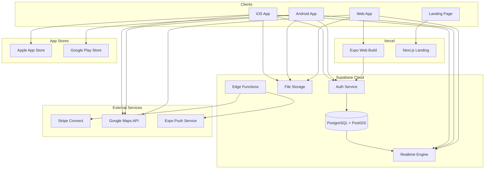
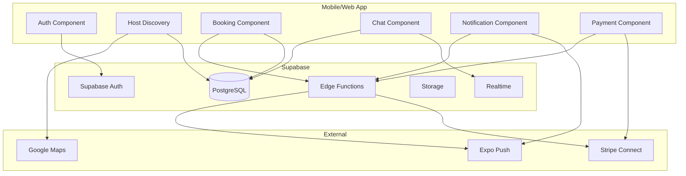
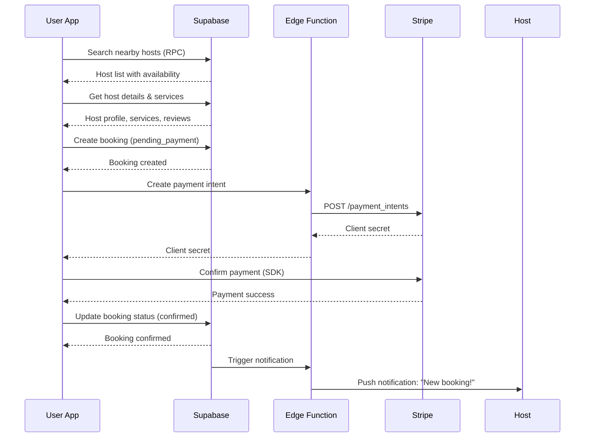
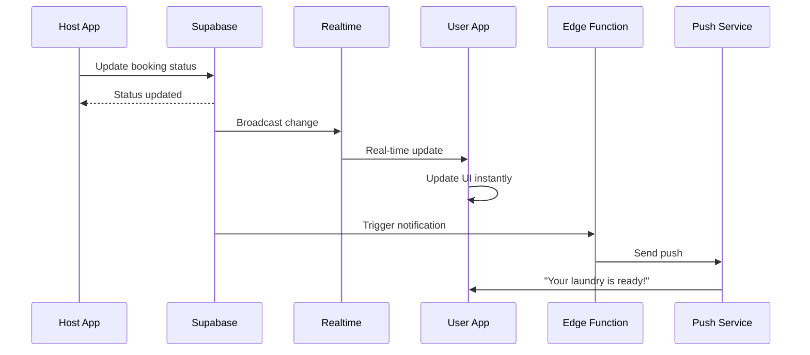
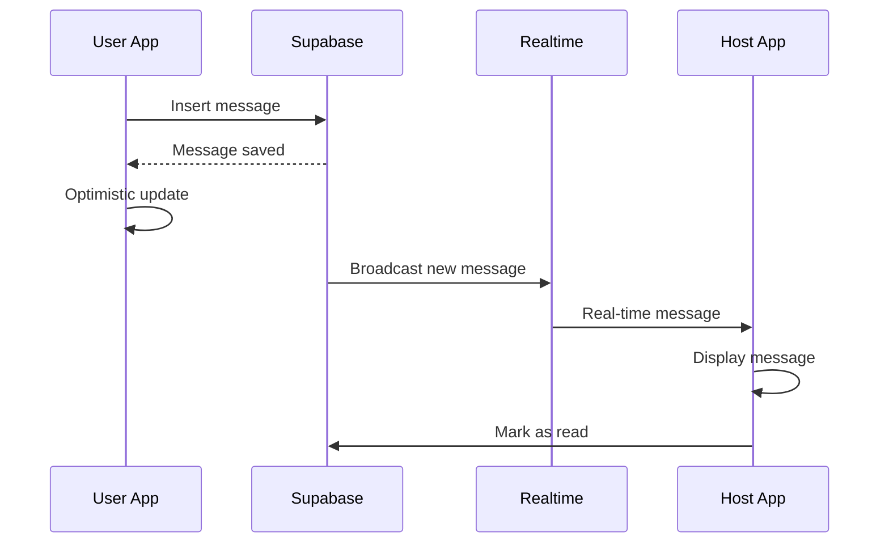
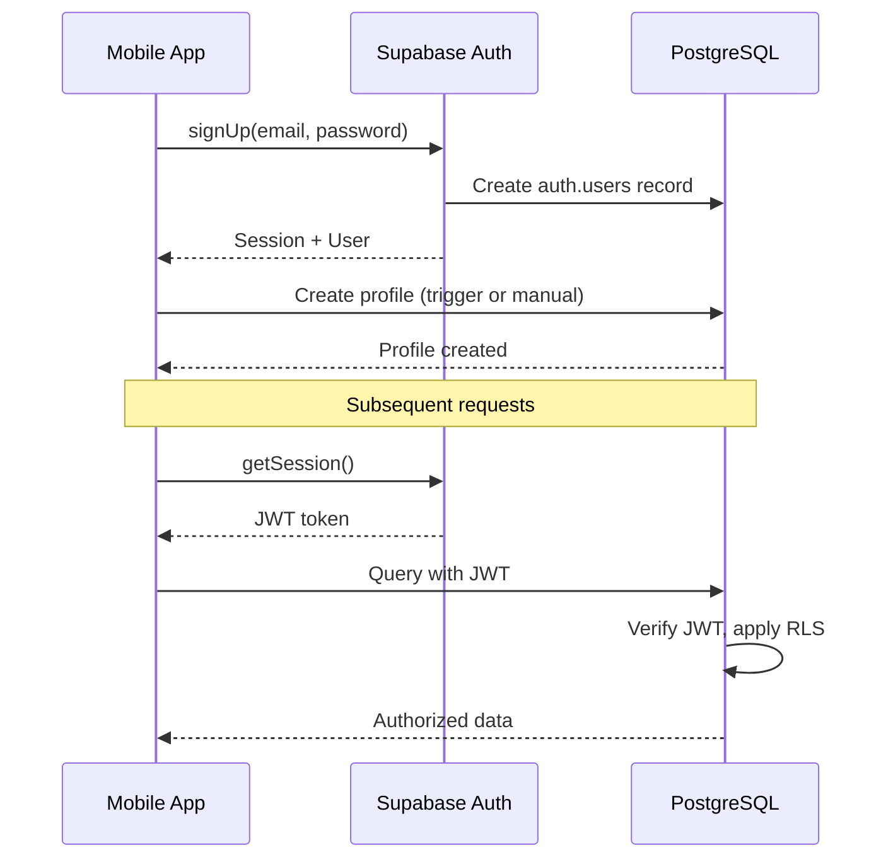

# LaundryShare Fullstack Architecture Document

---

## 1. Introduction

This document outlines the complete fullstack architecture for LaundryShare, a peer-to-peer laundry service marketplace. It covers the mobile/web application, backend services, database design, and infrastructure, serving as the single source of truth for AI-driven development.

### 1.1 Starter Template

**N/A - Greenfield project**

This is a new project built from scratch using:
- Expo SDK for React Native (managed workflow)
- Supabase as Backend-as-a-Service
- No starter template required

### 1.2 Change Log

| Date | Version | Description | Author |
|------|---------|-------------|--------|
| 2026-01-06 | 1.0 | Initial architecture document | Winston (Architect) |

---

## 2. High Level Architecture

### 2.1 Technical Summary

LaundryShare employs a **serverless, BaaS-first architecture** using Supabase as the primary backend, eliminating the need for custom server infrastructure. The frontend is built with **Expo (React Native)** enabling a single codebase for iOS, Android, and Web platforms.

The architecture follows a **real-time first** approach, leveraging Supabase's PostgreSQL with real-time subscriptions for live chat and order status updates. Authentication, file storage, and edge functions are all handled through Supabase's integrated services.

**Stripe Connect** powers the two-sided marketplace payments, handling user charges and host payouts with automatic commission deduction. The application is deployed via **Vercel** (web) and **EAS Build** (mobile app stores), with the database hosted on Supabase Cloud.

This architecture prioritizes **rapid development**, **low operational overhead**, and **cost efficiency** - ideal for an MVP that needs to validate product-market fit quickly.

### 2.2 Platform and Infrastructure Choice

**Platform:** Supabase + Vercel + Expo EAS

**Key Services:**
| Service | Provider | Purpose |
|---------|----------|---------|
| Database | Supabase (PostgreSQL) | Primary data store with PostGIS |
| Authentication | Supabase Auth | User/host authentication |
| Real-time | Supabase Realtime | Chat, status updates |
| File Storage | Supabase Storage | Profile photos, images |
| Edge Functions | Supabase Edge Functions | Stripe webhooks, business logic |
| Web Hosting | Vercel | Expo web app, Next.js landing |
| Mobile Builds | Expo EAS | iOS/Android compilation |
| Payments | Stripe Connect | Marketplace transactions |
| Maps | Google Maps Platform | Host discovery, geolocation |
| Push Notifications | Expo Push Service | Mobile notifications |

**Deployment Regions:**
- Supabase: EU West (Paris) - GDPR compliance
- Vercel: Edge network (auto-optimized)

### 2.3 Repository Structure

**Structure:** Monorepo with npm workspaces

**Monorepo Tool:** npm workspaces (simple, no additional tooling)

**Package Organization:**
```
laundryshare/
├── apps/
│   ├── mobile-web/     # Expo app (iOS, Android, Web)
│   └── landing/        # Next.js marketing site
├── packages/
│   └── shared/         # Shared types, constants, utilities
└── supabase/           # Supabase configuration and migrations
```

**Rationale:** npm workspaces provide sufficient monorepo capabilities without the complexity of Nx or Turborepo for a small team. All TypeScript types are shared via the `packages/shared` package.

### 2.4 High Level Architecture Diagram



### 2.5 Architectural Patterns

- **BaaS-First Architecture:** Supabase handles auth, database, real-time, and storage - no custom backend servers needed. *Rationale:* Faster development, lower ops overhead, automatic scaling.

- **Real-time Subscriptions:** PostgreSQL changes broadcast via Supabase Realtime for instant UI updates. *Rationale:* Chat and order status require sub-second updates without polling.

- **Row Level Security (RLS):** Database-level access control policies replace traditional API authorization. *Rationale:* Security enforced at data layer, impossible to bypass even with direct database access.

- **Edge Functions for Webhooks:** Stripe webhooks and complex operations handled by Deno-based edge functions. *Rationale:* Serverless, low latency, co-located with database.

- **Single App with Mode Toggle:** One Expo app serves both User and Host modes (like Uber). *Rationale:* Simpler maintenance, shared code, smaller bundle.

- **Optimistic Updates:** UI updates immediately, syncs with server in background. *Rationale:* Perceived performance improvement for common actions.

- **Offline-Tolerant Design:** Critical data cached locally, graceful degradation when offline. *Rationale:* Mobile users may have intermittent connectivity.

---

## 3. Tech Stack

| Category | Technology | Version | Purpose | Rationale |
|----------|------------|---------|---------|-----------|
| **Frontend Language** | TypeScript | 5.x | Type-safe development | Catch errors at compile time, better DX |
| **Frontend Framework** | React Native (Expo) | SDK 52 | Cross-platform mobile + web | Single codebase for iOS/Android/Web |
| **UI Component Library** | React Native Paper | 5.x | Material Design components | Consistent UI, accessibility built-in |
| **State Management** | Zustand + React Query | 4.x / 5.x | Client state + server state | Lightweight, separation of concerns |
| **Backend Language** | TypeScript | 5.x | Edge functions | Same language across stack |
| **Backend Framework** | Supabase | Latest | BaaS platform | Auth, DB, realtime, storage in one |
| **API Style** | Supabase Client SDK | Latest | Direct database access with RLS | No REST API layer needed |
| **Database** | PostgreSQL | 15 | Primary data store | ACID, PostGIS, JSON support |
| **Cache** | React Query | 5.x | Client-side caching | Automatic cache invalidation |
| **File Storage** | Supabase Storage | Latest | Images, files | Integrated with auth policies |
| **Authentication** | Supabase Auth | Latest | User authentication | Email, phone, OAuth providers |
| **Frontend Testing** | Jest + React Native Testing Library | Latest | Unit & component tests | Standard React Native testing |
| **Backend Testing** | Vitest | Latest | Edge function tests | Fast, TypeScript native |
| **E2E Testing** | Maestro | Latest | Mobile E2E tests | Mobile-native, simple YAML flows |
| **Build Tool** | Expo CLI / EAS | Latest | Build orchestration | Official Expo tooling |
| **Bundler** | Metro | Latest | React Native bundler | Default for Expo |
| **IaC Tool** | Supabase CLI | Latest | Database migrations | Version-controlled schema |
| **CI/CD** | GitHub Actions + EAS | Latest | Automated builds/deploys | Free tier sufficient for MVP |
| **Monitoring** | Sentry | Latest | Error tracking | React Native SDK available |
| **Logging** | Supabase Dashboard | N/A | Query & function logs | Built into platform |
| **CSS Framework** | NativeWind | 4.x | Tailwind for React Native | Familiar Tailwind syntax |

---

## 4. Data Models

### 4.1 Profile

**Purpose:** User account information for both users and hosts.

**Key Attributes:**
- `id`: UUID - Primary key, matches Supabase Auth user ID
- `email`: string - User email address
- `full_name`: string - Display name
- `phone`: string | null - Optional phone number
- `avatar_url`: string | null - Profile photo URL
- `created_at`: timestamp - Account creation date
- `updated_at`: timestamp - Last profile update

```typescript
interface Profile {
  id: string;
  email: string;
  full_name: string;
  phone: string | null;
  avatar_url: string | null;
  created_at: string;
  updated_at: string;
}
```

**Relationships:**
- One-to-one with Supabase Auth user
- One-to-one with Host (if registered as host)
- One-to-many with Booking (as user)

---

### 4.2 Host

**Purpose:** Host-specific information for users who offer laundry services.

**Key Attributes:**
- `id`: UUID - Primary key
- `user_id`: UUID - Foreign key to Profile
- `address`: string - Full address
- `location`: geography(Point) - PostGIS coordinates
- `description`: string | null - Host bio
- `machine_type`: string - Washing machine description
- `is_active`: boolean - Currently accepting bookings
- `rating_avg`: decimal - Average rating (computed)
- `rating_count`: integer - Total reviews (computed)
- `stripe_account_id`: string | null - Stripe Connect account
- `stripe_onboarding_complete`: boolean - Payout setup status

```typescript
interface Host {
  id: string;
  user_id: string;
  address: string;
  location: {
    type: 'Point';
    coordinates: [number, number]; // [lng, lat]
  };
  description: string | null;
  machine_type: string;
  is_active: boolean;
  rating_avg: number;
  rating_count: number;
  stripe_account_id: string | null;
  stripe_onboarding_complete: boolean;
  created_at: string;
  updated_at: string;
}
```

**Relationships:**
- One-to-one with Profile
- One-to-many with HostService
- One-to-many with HostAvailability
- One-to-many with Booking (as host)
- One-to-many with Review (received)

---

### 4.3 HostService

**Purpose:** Services offered by a host with pricing.

**Key Attributes:**
- `id`: UUID - Primary key
- `host_id`: UUID - Foreign key to Host
- `service_type`: enum - 'wash', 'wash_dry', 'ironing', 'folding'
- `price_per_kg`: decimal - Price in EUR
- `is_active`: boolean - Currently offered

```typescript
type ServiceType = 'wash' | 'wash_dry' | 'ironing' | 'folding';

interface HostService {
  id: string;
  host_id: string;
  service_type: ServiceType;
  price_per_kg: number;
  is_active: boolean;
  created_at: string;
}
```

**Relationships:**
- Many-to-one with Host

---

### 4.4 HostAvailability

**Purpose:** Recurring weekly availability schedule.

**Key Attributes:**
- `id`: UUID - Primary key
- `host_id`: UUID - Foreign key to Host
- `day_of_week`: integer - 0 (Sunday) to 6 (Saturday)
- `start_time`: time - Start of availability window
- `end_time`: time - End of availability window

```typescript
interface HostAvailability {
  id: string;
  host_id: string;
  day_of_week: number; // 0-6
  start_time: string; // HH:MM:SS
  end_time: string; // HH:MM:SS
}
```

**Relationships:**
- Many-to-one with Host

---

### 4.5 Booking

**Purpose:** A laundry service booking between user and host.

**Key Attributes:**
- `id`: UUID - Primary key
- `user_id`: UUID - Foreign key to Profile (customer)
- `host_id`: UUID - Foreign key to Host
- `status`: enum - Booking status
- `scheduled_date`: date - Scheduled drop-off date
- `scheduled_time`: time - Scheduled drop-off time
- `estimated_weight_kg`: decimal - Estimated laundry weight
- `services`: jsonb - Array of selected services
- `subtotal`: decimal - Before commission
- `commission`: decimal - Platform fee
- `total`: decimal - Amount charged to user
- `host_payout`: decimal - Amount to pay host
- `stripe_payment_intent_id`: string | null - Stripe reference
- `cancelled_at`: timestamp | null - If cancelled
- `cancellation_reason`: string | null - Reason for cancellation

```typescript
type BookingStatus =
  | 'pending_payment'
  | 'confirmed'
  | 'dropped_off'
  | 'washing'
  | 'drying'
  | 'ready'
  | 'picked_up'
  | 'cancelled';

interface Booking {
  id: string;
  user_id: string;
  host_id: string;
  status: BookingStatus;
  scheduled_date: string; // YYYY-MM-DD
  scheduled_time: string; // HH:MM:SS
  estimated_weight_kg: number;
  services: {
    service_type: ServiceType;
    price_per_kg: number;
  }[];
  subtotal: number;
  commission: number;
  total: number;
  host_payout: number;
  stripe_payment_intent_id: string | null;
  cancelled_at: string | null;
  cancellation_reason: string | null;
  created_at: string;
  updated_at: string;
}
```

**Relationships:**
- Many-to-one with Profile (user)
- Many-to-one with Host
- One-to-many with Message
- One-to-one with Review

---

### 4.6 Message

**Purpose:** Chat messages between user and host for a booking.

**Key Attributes:**
- `id`: UUID - Primary key
- `booking_id`: UUID - Foreign key to Booking
- `sender_id`: UUID - Foreign key to Profile
- `content`: text - Message text
- `read_at`: timestamp | null - When recipient read it

```typescript
interface Message {
  id: string;
  booking_id: string;
  sender_id: string;
  content: string;
  read_at: string | null;
  created_at: string;
}
```

**Relationships:**
- Many-to-one with Booking
- Many-to-one with Profile (sender)

---

### 4.7 Review

**Purpose:** User review of host after service completion.

**Key Attributes:**
- `id`: UUID - Primary key
- `booking_id`: UUID - Foreign key to Booking (unique)
- `user_id`: UUID - Foreign key to Profile (reviewer)
- `host_id`: UUID - Foreign key to Host (reviewed)
- `rating`: integer - 1-5 stars
- `comment`: text | null - Review text

```typescript
interface Review {
  id: string;
  booking_id: string;
  user_id: string;
  host_id: string;
  rating: number; // 1-5
  comment: string | null;
  created_at: string;
}
```

**Relationships:**
- One-to-one with Booking
- Many-to-one with Profile
- Many-to-one with Host

---

### 4.8 HostPayout

**Purpose:** Track payouts to hosts.

**Key Attributes:**
- `id`: UUID - Primary key
- `host_id`: UUID - Foreign key to Host
- `amount`: decimal - Payout amount
- `stripe_payout_id`: string - Stripe reference
- `status`: enum - 'pending', 'paid', 'failed'

```typescript
type PayoutStatus = 'pending' | 'paid' | 'failed';

interface HostPayout {
  id: string;
  host_id: string;
  amount: number;
  stripe_payout_id: string;
  status: PayoutStatus;
  created_at: string;
  paid_at: string | null;
}
```

---

## 5. API Specification

LaundryShare uses **Supabase Client SDK** instead of a traditional REST API. Data access is performed directly against PostgreSQL with Row Level Security (RLS) policies enforcing authorization.

### 5.1 Supabase Client Usage Pattern

```typescript
import { createClient } from '@supabase/supabase-js';
import { Database } from '@/types/database';

export const supabase = createClient<Database>(
  process.env.EXPO_PUBLIC_SUPABASE_URL!,
  process.env.EXPO_PUBLIC_SUPABASE_ANON_KEY!
);

// Example: Fetch nearby hosts
const { data: hosts, error } = await supabase
  .rpc('get_nearby_hosts', {
    user_lat: 48.8566,
    user_lng: 2.3522,
    radius_km: 5
  });

// Example: Create booking
const { data: booking, error } = await supabase
  .from('bookings')
  .insert({
    host_id: hostId,
    scheduled_date: '2026-01-10',
    scheduled_time: '10:00:00',
    estimated_weight_kg: 5,
    services: [{ service_type: 'wash_dry', price_per_kg: 3.5 }]
  })
  .select()
  .single();
```

### 5.2 Edge Functions (API Endpoints)

Edge Functions handle operations requiring server-side logic:

| Function | Method | Purpose |
|----------|--------|---------|
| `/create-payment-intent` | POST | Create Stripe PaymentIntent for booking |
| `/stripe-webhook` | POST | Handle Stripe webhook events |
| `/create-connect-account` | POST | Create Stripe Connect account for host |
| `/create-connect-link` | POST | Generate Stripe onboarding link |
| `/request-payout` | POST | Initiate payout to host |
| `/send-notification` | POST | Send push notification via Expo |

### 5.3 Database Functions (RPCs)

| Function | Purpose |
|----------|---------|
| `get_nearby_hosts(lat, lng, radius_km)` | PostGIS proximity search |
| `get_host_availability(host_id, date)` | Get available time slots |
| `update_host_rating(host_id)` | Recalculate average rating |
| `get_unread_message_count(user_id)` | Count unread messages |

---

## 6. Components

### 6.1 Authentication Component

**Responsibility:** Handle user signup, login, logout, and session management.

**Key Interfaces:**
- `signUp(email, password)` - Create new account
- `signIn(email, password)` - Email/password login
- `signInWithOAuth(provider)` - Social login
- `signOut()` - End session
- `getSession()` - Get current session

**Dependencies:** Supabase Auth

**Technology Stack:** Supabase Auth SDK, secure token storage (expo-secure-store)

---

### 6.2 Host Discovery Component

**Responsibility:** Search, filter, and display nearby hosts.

**Key Interfaces:**
- `searchHosts(location, filters)` - Query hosts with criteria
- `getHostProfile(hostId)` - Fetch host details
- `getHostAvailability(hostId, date)` - Get time slots
- `getHostReviews(hostId)` - Fetch reviews

**Dependencies:** Supabase Database, Google Maps API

**Technology Stack:** React Query for caching, react-native-maps

---

### 6.3 Booking Component

**Responsibility:** Manage booking creation, payment, and lifecycle.

**Key Interfaces:**
- `createBooking(hostId, details)` - Create new booking
- `processPayment(bookingId)` - Handle Stripe payment
- `cancelBooking(bookingId)` - Cancel with refund logic
- `updateStatus(bookingId, status)` - Progress booking status

**Dependencies:** Supabase Database, Stripe SDK, Edge Functions

**Technology Stack:** @stripe/stripe-react-native, Supabase Edge Functions

---

### 6.4 Chat Component

**Responsibility:** Real-time messaging between users and hosts.

**Key Interfaces:**
- `sendMessage(bookingId, content)` - Send message
- `subscribeToMessages(bookingId)` - Real-time updates
- `markAsRead(messageId)` - Mark message read
- `getConversation(bookingId)` - Fetch message history

**Dependencies:** Supabase Realtime

**Technology Stack:** Supabase real-time subscriptions, optimistic updates

---

### 6.5 Notification Component

**Responsibility:** Handle push notifications for bookings, messages, and status updates.

**Key Interfaces:**
- `registerForPushNotifications()` - Get Expo push token
- `saveToken(token)` - Store token in database
- `sendNotification(userId, title, body)` - Trigger notification

**Dependencies:** Expo Push Service, Supabase Edge Functions

**Technology Stack:** expo-notifications, Supabase Edge Functions

---

### 6.6 Payment Component

**Responsibility:** Handle Stripe payments and host payouts.

**Key Interfaces:**
- `createPaymentIntent(amount)` - Get client secret
- `confirmPayment(clientSecret)` - Process card payment
- `createConnectAccount(hostId)` - Setup host payout account
- `requestPayout(hostId, amount)` - Initiate host payout

**Dependencies:** Stripe Connect, Supabase Edge Functions

**Technology Stack:** @stripe/stripe-react-native, Stripe Node SDK (edge functions)

---

### 6.7 Component Diagram



---

## 7. External APIs

### 7.1 Stripe Connect API

**Purpose:** Payment processing and marketplace payouts

**Documentation:** https://stripe.com/docs/connect

**Base URL:** `https://api.stripe.com/v1`

**Authentication:** API key (secret key in edge functions only)

**Rate Limits:** 100 requests/second (test), 10,000/second (live)

**Key Endpoints Used:**
- `POST /v1/payment_intents` - Create payment intent
- `POST /v1/accounts` - Create Connect account
- `POST /v1/account_links` - Generate onboarding link
- `POST /v1/payouts` - Create payout to host
- `POST /v1/webhook` - Receive webhook events

**Integration Notes:**
- Use Stripe Connect "Express" accounts for simplified host onboarding
- Platform fee deducted via `application_fee_amount` parameter
- Webhook events: `payment_intent.succeeded`, `payout.paid`, `account.updated`

---

### 7.2 Google Maps Platform API

**Purpose:** Map display, geocoding, places autocomplete

**Documentation:** https://developers.google.com/maps/documentation

**Base URL:** Various (Maps JS, Places, Geocoding)

**Authentication:** API key (restricted by app bundle ID)

**Rate Limits:** Pay-per-use after $200/month free credit

**Key Endpoints Used:**
- Maps SDK for React Native - Display map with markers
- Places Autocomplete - Address input with suggestions
- Geocoding API - Convert address to coordinates

**Integration Notes:**
- Restrict API key to app bundle IDs
- Use react-native-maps with Google provider
- Cache geocoding results to reduce API calls

---

### 7.3 Expo Push Notification Service

**Purpose:** Send push notifications to mobile devices

**Documentation:** https://docs.expo.dev/push-notifications/overview/

**Base URL:** `https://exp.host/--/api/v2/push/send`

**Authentication:** None required (token-based delivery)

**Rate Limits:** 600 notifications/minute per project

**Key Endpoints Used:**
- `POST /--/api/v2/push/send` - Send single or batch notifications

**Integration Notes:**
- Push tokens stored in `profiles.push_token`
- Handle token refresh on app launch
- Batch notifications when possible

---

## 8. Core Workflows

### 8.1 Booking Flow



### 8.2 Order Status Update Flow



### 8.3 Chat Flow



---

## 9. Database Schema

### 9.1 Schema Definition (PostgreSQL)

```sql
-- Enable PostGIS extension
CREATE EXTENSION IF NOT EXISTS postgis;

-- Profiles table (extends Supabase auth.users)
CREATE TABLE profiles (
    id UUID PRIMARY KEY REFERENCES auth.users(id) ON DELETE CASCADE,
    email TEXT NOT NULL,
    full_name TEXT NOT NULL,
    phone TEXT,
    avatar_url TEXT,
    push_token TEXT,
    created_at TIMESTAMPTZ DEFAULT NOW(),
    updated_at TIMESTAMPTZ DEFAULT NOW()
);

-- Hosts table
CREATE TABLE hosts (
    id UUID PRIMARY KEY DEFAULT gen_random_uuid(),
    user_id UUID NOT NULL REFERENCES profiles(id) ON DELETE CASCADE UNIQUE,
    address TEXT NOT NULL,
    location GEOGRAPHY(POINT, 4326) NOT NULL,
    description TEXT,
    machine_type TEXT NOT NULL,
    is_active BOOLEAN DEFAULT FALSE,
    rating_avg DECIMAL(2,1) DEFAULT 0,
    rating_count INTEGER DEFAULT 0,
    stripe_account_id TEXT,
    stripe_onboarding_complete BOOLEAN DEFAULT FALSE,
    created_at TIMESTAMPTZ DEFAULT NOW(),
    updated_at TIMESTAMPTZ DEFAULT NOW()
);

-- Host services
CREATE TABLE host_services (
    id UUID PRIMARY KEY DEFAULT gen_random_uuid(),
    host_id UUID NOT NULL REFERENCES hosts(id) ON DELETE CASCADE,
    service_type TEXT NOT NULL CHECK (service_type IN ('wash', 'wash_dry', 'ironing', 'folding')),
    price_per_kg DECIMAL(10,2) NOT NULL,
    is_active BOOLEAN DEFAULT TRUE,
    created_at TIMESTAMPTZ DEFAULT NOW(),
    UNIQUE(host_id, service_type)
);

-- Host availability (recurring weekly)
CREATE TABLE host_availability (
    id UUID PRIMARY KEY DEFAULT gen_random_uuid(),
    host_id UUID NOT NULL REFERENCES hosts(id) ON DELETE CASCADE,
    day_of_week INTEGER NOT NULL CHECK (day_of_week BETWEEN 0 AND 6),
    start_time TIME NOT NULL,
    end_time TIME NOT NULL,
    UNIQUE(host_id, day_of_week)
);

-- Host blocked dates
CREATE TABLE host_blocked_dates (
    id UUID PRIMARY KEY DEFAULT gen_random_uuid(),
    host_id UUID NOT NULL REFERENCES hosts(id) ON DELETE CASCADE,
    blocked_date DATE NOT NULL,
    reason TEXT,
    UNIQUE(host_id, blocked_date)
);

-- Bookings
CREATE TABLE bookings (
    id UUID PRIMARY KEY DEFAULT gen_random_uuid(),
    user_id UUID NOT NULL REFERENCES profiles(id),
    host_id UUID NOT NULL REFERENCES hosts(id),
    status TEXT NOT NULL DEFAULT 'pending_payment' CHECK (status IN (
        'pending_payment', 'confirmed', 'dropped_off',
        'washing', 'drying', 'ready', 'picked_up', 'cancelled'
    )),
    scheduled_date DATE NOT NULL,
    scheduled_time TIME NOT NULL,
    estimated_weight_kg DECIMAL(5,2) NOT NULL,
    services JSONB NOT NULL,
    subtotal DECIMAL(10,2) NOT NULL,
    commission DECIMAL(10,2) NOT NULL,
    total DECIMAL(10,2) NOT NULL,
    host_payout DECIMAL(10,2) NOT NULL,
    stripe_payment_intent_id TEXT,
    cancelled_at TIMESTAMPTZ,
    cancellation_reason TEXT,
    created_at TIMESTAMPTZ DEFAULT NOW(),
    updated_at TIMESTAMPTZ DEFAULT NOW()
);

-- Messages
CREATE TABLE messages (
    id UUID PRIMARY KEY DEFAULT gen_random_uuid(),
    booking_id UUID NOT NULL REFERENCES bookings(id) ON DELETE CASCADE,
    sender_id UUID NOT NULL REFERENCES profiles(id),
    content TEXT NOT NULL,
    read_at TIMESTAMPTZ,
    created_at TIMESTAMPTZ DEFAULT NOW()
);

-- Reviews
CREATE TABLE reviews (
    id UUID PRIMARY KEY DEFAULT gen_random_uuid(),
    booking_id UUID NOT NULL REFERENCES bookings(id) UNIQUE,
    user_id UUID NOT NULL REFERENCES profiles(id),
    host_id UUID NOT NULL REFERENCES hosts(id),
    rating INTEGER NOT NULL CHECK (rating BETWEEN 1 AND 5),
    comment TEXT,
    created_at TIMESTAMPTZ DEFAULT NOW()
);

-- Host payouts
CREATE TABLE host_payouts (
    id UUID PRIMARY KEY DEFAULT gen_random_uuid(),
    host_id UUID NOT NULL REFERENCES hosts(id),
    amount DECIMAL(10,2) NOT NULL,
    stripe_payout_id TEXT NOT NULL,
    status TEXT NOT NULL DEFAULT 'pending' CHECK (status IN ('pending', 'paid', 'failed')),
    created_at TIMESTAMPTZ DEFAULT NOW(),
    paid_at TIMESTAMPTZ
);

-- Indexes
CREATE INDEX idx_hosts_location ON hosts USING GIST (location);
CREATE INDEX idx_hosts_active ON hosts (is_active) WHERE is_active = TRUE;
CREATE INDEX idx_bookings_user ON bookings (user_id, created_at DESC);
CREATE INDEX idx_bookings_host ON bookings (host_id, scheduled_date);
CREATE INDEX idx_bookings_status ON bookings (status) WHERE status NOT IN ('picked_up', 'cancelled');
CREATE INDEX idx_messages_booking ON messages (booking_id, created_at);
CREATE INDEX idx_reviews_host ON reviews (host_id, created_at DESC);

-- Function: Get nearby hosts
CREATE OR REPLACE FUNCTION get_nearby_hosts(
    user_lat DOUBLE PRECISION,
    user_lng DOUBLE PRECISION,
    radius_km DOUBLE PRECISION DEFAULT 5
)
RETURNS TABLE (
    id UUID,
    user_id UUID,
    address TEXT,
    distance_km DOUBLE PRECISION,
    description TEXT,
    machine_type TEXT,
    rating_avg DECIMAL,
    rating_count INTEGER,
    full_name TEXT,
    avatar_url TEXT
) AS $$
BEGIN
    RETURN QUERY
    SELECT
        h.id,
        h.user_id,
        h.address,
        ST_Distance(h.location, ST_MakePoint(user_lng, user_lat)::geography) / 1000 as distance_km,
        h.description,
        h.machine_type,
        h.rating_avg,
        h.rating_count,
        p.full_name,
        p.avatar_url
    FROM hosts h
    JOIN profiles p ON h.user_id = p.id
    WHERE h.is_active = TRUE
    AND ST_DWithin(h.location, ST_MakePoint(user_lng, user_lat)::geography, radius_km * 1000)
    ORDER BY distance_km;
END;
$$ LANGUAGE plpgsql;

-- Function: Update host rating
CREATE OR REPLACE FUNCTION update_host_rating()
RETURNS TRIGGER AS $$
BEGIN
    UPDATE hosts
    SET
        rating_avg = (SELECT AVG(rating)::DECIMAL(2,1) FROM reviews WHERE host_id = NEW.host_id),
        rating_count = (SELECT COUNT(*) FROM reviews WHERE host_id = NEW.host_id)
    WHERE id = NEW.host_id;
    RETURN NEW;
END;
$$ LANGUAGE plpgsql;

CREATE TRIGGER trigger_update_host_rating
AFTER INSERT ON reviews
FOR EACH ROW EXECUTE FUNCTION update_host_rating();
```

### 9.2 Row Level Security (RLS) Policies

```sql
-- Enable RLS on all tables
ALTER TABLE profiles ENABLE ROW LEVEL SECURITY;
ALTER TABLE hosts ENABLE ROW LEVEL SECURITY;
ALTER TABLE host_services ENABLE ROW LEVEL SECURITY;
ALTER TABLE host_availability ENABLE ROW LEVEL SECURITY;
ALTER TABLE host_blocked_dates ENABLE ROW LEVEL SECURITY;
ALTER TABLE bookings ENABLE ROW LEVEL SECURITY;
ALTER TABLE messages ENABLE ROW LEVEL SECURITY;
ALTER TABLE reviews ENABLE ROW LEVEL SECURITY;
ALTER TABLE host_payouts ENABLE ROW LEVEL SECURITY;

-- Profiles: Users can read all, update own
CREATE POLICY "Profiles are viewable by everyone" ON profiles FOR SELECT USING (true);
CREATE POLICY "Users can update own profile" ON profiles FOR UPDATE USING (auth.uid() = id);

-- Hosts: Public read for active, owners can manage
CREATE POLICY "Active hosts are viewable" ON hosts FOR SELECT USING (is_active = TRUE OR user_id = auth.uid());
CREATE POLICY "Users can create own host profile" ON hosts FOR INSERT WITH CHECK (user_id = auth.uid());
CREATE POLICY "Hosts can update own profile" ON hosts FOR UPDATE USING (user_id = auth.uid());

-- Host services: Public read, host manages own
CREATE POLICY "Services are viewable" ON host_services FOR SELECT USING (true);
CREATE POLICY "Hosts can manage own services" ON host_services FOR ALL USING (
    host_id IN (SELECT id FROM hosts WHERE user_id = auth.uid())
);

-- Bookings: User and host can see their bookings
CREATE POLICY "Users can view own bookings" ON bookings FOR SELECT USING (
    user_id = auth.uid() OR host_id IN (SELECT id FROM hosts WHERE user_id = auth.uid())
);
CREATE POLICY "Users can create bookings" ON bookings FOR INSERT WITH CHECK (user_id = auth.uid());
CREATE POLICY "Booking participants can update" ON bookings FOR UPDATE USING (
    user_id = auth.uid() OR host_id IN (SELECT id FROM hosts WHERE user_id = auth.uid())
);

-- Messages: Only booking participants
CREATE POLICY "Booking participants can view messages" ON messages FOR SELECT USING (
    booking_id IN (
        SELECT id FROM bookings WHERE user_id = auth.uid()
        OR host_id IN (SELECT id FROM hosts WHERE user_id = auth.uid())
    )
);
CREATE POLICY "Booking participants can send messages" ON messages FOR INSERT WITH CHECK (
    sender_id = auth.uid() AND booking_id IN (
        SELECT id FROM bookings WHERE user_id = auth.uid()
        OR host_id IN (SELECT id FROM hosts WHERE user_id = auth.uid())
    )
);

-- Reviews: Public read, users can create for own bookings
CREATE POLICY "Reviews are viewable" ON reviews FOR SELECT USING (true);
CREATE POLICY "Users can review own bookings" ON reviews FOR INSERT WITH CHECK (
    user_id = auth.uid() AND booking_id IN (SELECT id FROM bookings WHERE user_id = auth.uid())
);

-- Host payouts: Only host can view own
CREATE POLICY "Hosts can view own payouts" ON host_payouts FOR SELECT USING (
    host_id IN (SELECT id FROM hosts WHERE user_id = auth.uid())
);
```

---

## 10. Frontend Architecture

### 10.1 Component Organization

```
apps/mobile-web/src/
├── components/
│   ├── common/           # Shared UI components
│   │   ├── Button.tsx
│   │   ├── Card.tsx
│   │   ├── Input.tsx
│   │   ├── Avatar.tsx
│   │   └── Rating.tsx
│   ├── booking/          # Booking-related components
│   │   ├── BookingCard.tsx
│   │   ├── ServiceSelector.tsx
│   │   ├── TimeSlotPicker.tsx
│   │   └── StatusTimeline.tsx
│   ├── host/             # Host-related components
│   │   ├── HostCard.tsx
│   │   ├── HostProfile.tsx
│   │   ├── AvailabilityCalendar.tsx
│   │   └── ReviewList.tsx
│   ├── chat/             # Chat components
│   │   ├── MessageBubble.tsx
│   │   ├── ChatInput.tsx
│   │   └── ConversationList.tsx
│   └── map/              # Map components
│       ├── HostMap.tsx
│       └── HostMarker.tsx
├── screens/
│   ├── auth/
│   │   ├── LoginScreen.tsx
│   │   ├── SignupScreen.tsx
│   │   └── ProfileSetupScreen.tsx
│   ├── user/
│   │   ├── HomeScreen.tsx
│   │   ├── HostDetailScreen.tsx
│   │   ├── BookingScreen.tsx
│   │   ├── MyOrdersScreen.tsx
│   │   └── OrderDetailScreen.tsx
│   ├── host/
│   │   ├── DashboardScreen.tsx
│   │   ├── CalendarScreen.tsx
│   │   ├── EarningsScreen.tsx
│   │   └── HostProfileScreen.tsx
│   └── shared/
│       ├── ChatScreen.tsx
│       ├── SettingsScreen.tsx
│       └── NotificationsScreen.tsx
├── navigation/
│   ├── RootNavigator.tsx
│   ├── AuthNavigator.tsx
│   ├── UserNavigator.tsx
│   └── HostNavigator.tsx
├── hooks/
│   ├── useAuth.ts
│   ├── useBooking.ts
│   ├── useHosts.ts
│   ├── useChat.ts
│   └── useLocation.ts
├── services/
│   ├── supabase.ts
│   ├── stripe.ts
│   ├── notifications.ts
│   └── location.ts
├── stores/
│   ├── authStore.ts
│   ├── modeStore.ts
│   └── notificationStore.ts
├── types/
│   └── database.ts       # Generated Supabase types
└── utils/
    ├── formatters.ts
    ├── validators.ts
    └── constants.ts
```

### 10.2 Component Template

```typescript
// Example: HostCard.tsx
import { View, Text, Pressable } from 'react-native';
import { Avatar, Rating } from '@/components/common';
import { Host } from '@/types/database';

interface HostCardProps {
  host: Host & { full_name: string; avatar_url: string | null };
  distance: number;
  onPress: () => void;
}

export function HostCard({ host, distance, onPress }: HostCardProps) {
  return (
    <Pressable onPress={onPress} className="bg-white rounded-lg p-4 shadow-sm">
      <View className="flex-row items-center">
        <Avatar url={host.avatar_url} name={host.full_name} size={48} />
        <View className="ml-3 flex-1">
          <Text className="font-semibold text-gray-900">{host.full_name}</Text>
          <Text className="text-gray-500 text-sm">{distance.toFixed(1)} km away</Text>
        </View>
        <Rating value={host.rating_avg} count={host.rating_count} />
      </View>
    </Pressable>
  );
}
```

### 10.3 State Management

**Structure:**

```typescript
// stores/authStore.ts
import { create } from 'zustand';
import { persist, createJSONStorage } from 'zustand/middleware';
import AsyncStorage from '@react-native-async-storage/async-storage';
import { Profile, Host } from '@/types/database';

interface AuthState {
  user: Profile | null;
  host: Host | null;
  isLoading: boolean;
  setUser: (user: Profile | null) => void;
  setHost: (host: Host | null) => void;
  signOut: () => void;
}

export const useAuthStore = create<AuthState>()(
  persist(
    (set) => ({
      user: null,
      host: null,
      isLoading: true,
      setUser: (user) => set({ user }),
      setHost: (host) => set({ host }),
      signOut: () => set({ user: null, host: null }),
    }),
    {
      name: 'auth-storage',
      storage: createJSONStorage(() => AsyncStorage),
    }
  )
);

// stores/modeStore.ts
type AppMode = 'user' | 'host';

interface ModeState {
  mode: AppMode;
  setMode: (mode: AppMode) => void;
  toggleMode: () => void;
}

export const useModeStore = create<ModeState>((set) => ({
  mode: 'user',
  setMode: (mode) => set({ mode }),
  toggleMode: () => set((state) => ({
    mode: state.mode === 'user' ? 'host' : 'user'
  })),
}));
```

**State Management Patterns:**
- Use Zustand for global client state (auth, app mode, notifications)
- Use React Query for server state (bookings, hosts, messages)
- Local component state for UI-only state (form inputs, modals)
- Persist auth state with AsyncStorage

### 10.4 Routing Architecture

```typescript
// navigation/RootNavigator.tsx
import { NavigationContainer } from '@react-navigation/native';
import { createNativeStackNavigator } from '@react-navigation/native-stack';
import { useAuthStore } from '@/stores/authStore';
import { AuthNavigator } from './AuthNavigator';
import { MainNavigator } from './MainNavigator';

const Stack = createNativeStackNavigator();

export function RootNavigator() {
  const user = useAuthStore((state) => state.user);

  return (
    <NavigationContainer>
      <Stack.Navigator screenOptions={{ headerShown: false }}>
        {user ? (
          <Stack.Screen name="Main" component={MainNavigator} />
        ) : (
          <Stack.Screen name="Auth" component={AuthNavigator} />
        )}
      </Stack.Navigator>
    </NavigationContainer>
  );
}

// Protected route pattern
function HostOnlyScreen({ children }: { children: React.ReactNode }) {
  const host = useAuthStore((state) => state.host);

  if (!host) {
    return <BecomeHostPrompt />;
  }

  return <>{children}</>;
}
```

### 10.5 API Client Setup

```typescript
// services/supabase.ts
import 'react-native-url-polyfill/auto';
import { createClient } from '@supabase/supabase-js';
import AsyncStorage from '@react-native-async-storage/async-storage';
import { Database } from '@/types/database';

const supabaseUrl = process.env.EXPO_PUBLIC_SUPABASE_URL!;
const supabaseAnonKey = process.env.EXPO_PUBLIC_SUPABASE_ANON_KEY!;

export const supabase = createClient<Database>(supabaseUrl, supabaseAnonKey, {
  auth: {
    storage: AsyncStorage,
    autoRefreshToken: true,
    persistSession: true,
    detectSessionInUrl: false,
  },
});

// hooks/useHosts.ts
import { useQuery } from '@tanstack/react-query';
import { supabase } from '@/services/supabase';

export function useNearbyHosts(lat: number, lng: number, radius: number = 5) {
  return useQuery({
    queryKey: ['hosts', 'nearby', lat, lng, radius],
    queryFn: async () => {
      const { data, error } = await supabase.rpc('get_nearby_hosts', {
        user_lat: lat,
        user_lng: lng,
        radius_km: radius,
      });
      if (error) throw error;
      return data;
    },
    enabled: !!lat && !!lng,
    staleTime: 1000 * 60 * 5, // 5 minutes
  });
}
```

---

## 11. Backend Architecture

### 11.1 Edge Function Organization

```
supabase/
├── functions/
│   ├── create-payment-intent/
│   │   └── index.ts
│   ├── stripe-webhook/
│   │   └── index.ts
│   ├── create-connect-account/
│   │   └── index.ts
│   ├── create-connect-link/
│   │   └── index.ts
│   ├── request-payout/
│   │   └── index.ts
│   └── send-notification/
│       └── index.ts
├── migrations/
│   ├── 20260106000000_initial_schema.sql
│   └── 20260106000001_rls_policies.sql
├── seed.sql
└── config.toml
```

### 11.2 Edge Function Template

```typescript
// supabase/functions/create-payment-intent/index.ts
import { serve } from 'https://deno.land/std@0.168.0/http/server.ts';
import { createClient } from 'https://esm.sh/@supabase/supabase-js@2';
import Stripe from 'https://esm.sh/stripe@12?target=deno';

const stripe = new Stripe(Deno.env.get('STRIPE_SECRET_KEY')!, {
  apiVersion: '2023-10-16',
});

const corsHeaders = {
  'Access-Control-Allow-Origin': '*',
  'Access-Control-Allow-Headers': 'authorization, x-client-info, apikey, content-type',
};

serve(async (req) => {
  if (req.method === 'OPTIONS') {
    return new Response('ok', { headers: corsHeaders });
  }

  try {
    const supabase = createClient(
      Deno.env.get('SUPABASE_URL')!,
      Deno.env.get('SUPABASE_ANON_KEY')!,
      { global: { headers: { Authorization: req.headers.get('Authorization')! } } }
    );

    const { data: { user }, error: authError } = await supabase.auth.getUser();
    if (authError || !user) throw new Error('Unauthorized');

    const { bookingId } = await req.json();

    // Get booking details
    const { data: booking, error: bookingError } = await supabase
      .from('bookings')
      .select('*, hosts(stripe_account_id)')
      .eq('id', bookingId)
      .single();

    if (bookingError || !booking) throw new Error('Booking not found');

    // Create payment intent with platform fee
    const paymentIntent = await stripe.paymentIntents.create({
      amount: Math.round(booking.total * 100), // cents
      currency: 'eur',
      application_fee_amount: Math.round(booking.commission * 100),
      transfer_data: {
        destination: booking.hosts.stripe_account_id,
      },
      metadata: {
        booking_id: bookingId,
        user_id: user.id,
      },
    });

    // Update booking with payment intent ID
    await supabase
      .from('bookings')
      .update({ stripe_payment_intent_id: paymentIntent.id })
      .eq('id', bookingId);

    return new Response(
      JSON.stringify({ clientSecret: paymentIntent.client_secret }),
      { headers: { ...corsHeaders, 'Content-Type': 'application/json' } }
    );
  } catch (error) {
    return new Response(
      JSON.stringify({ error: error.message }),
      { status: 400, headers: { ...corsHeaders, 'Content-Type': 'application/json' } }
    );
  }
});
```

### 11.3 Authentication Flow



---

## 12. Unified Project Structure

```
laundryshare/
├── .github/
│   └── workflows/
│       ├── ci.yml                 # Lint, test, type-check
│       ├── deploy-web.yml         # Deploy Expo web to Vercel
│       └── eas-build.yml          # Trigger EAS builds
├── apps/
│   ├── mobile-web/                # Expo app
│   │   ├── src/
│   │   │   ├── components/
│   │   │   ├── screens/
│   │   │   ├── navigation/
│   │   │   ├── hooks/
│   │   │   ├── services/
│   │   │   ├── stores/
│   │   │   ├── types/
│   │   │   └── utils/
│   │   ├── assets/
│   │   ├── app.json
│   │   ├── App.tsx
│   │   ├── babel.config.js
│   │   ├── metro.config.js
│   │   ├── tailwind.config.js
│   │   ├── tsconfig.json
│   │   └── package.json
│   └── landing/                   # Next.js landing page
│       ├── src/
│       │   ├── app/
│       │   ├── components/
│       │   └── styles/
│       ├── public/
│       ├── next.config.js
│       ├── tailwind.config.js
│       ├── tsconfig.json
│       └── package.json
├── packages/
│   └── shared/                    # Shared code
│       ├── src/
│       │   ├── types/
│       │   │   ├── database.ts    # Generated Supabase types
│       │   │   └── index.ts
│       │   ├── constants/
│       │   │   ├── booking.ts
│       │   │   └── index.ts
│       │   └── utils/
│       │       ├── formatters.ts
│       │       └── index.ts
│       ├── tsconfig.json
│       └── package.json
├── supabase/
│   ├── functions/
│   │   ├── create-payment-intent/
│   │   ├── stripe-webhook/
│   │   ├── create-connect-account/
│   │   ├── create-connect-link/
│   │   ├── request-payout/
│   │   └── send-notification/
│   ├── migrations/
│   ├── seed.sql
│   └── config.toml
├── docs/
│   ├── brief.md
│   ├── prd.md
│   └── architecture.md
├── .env.example
├── .gitignore
├── package.json                   # Root package.json with workspaces
├── tsconfig.base.json
└── README.md
```

---

## 13. Development Workflow

### 13.1 Prerequisites

```bash
# Required tools
node >= 18.0.0
npm >= 9.0.0
git

# Install Expo CLI globally
npm install -g expo-cli eas-cli

# Install Supabase CLI
npm install -g supabase

# iOS development (macOS only)
xcode-select --install

# Android development
# Install Android Studio and configure ANDROID_HOME
```

### 13.2 Initial Setup

```bash
# Clone repository
git clone https://github.com/your-org/laundryshare.git
cd laundryshare

# Install dependencies
npm install

# Setup environment variables
cp .env.example .env.local
# Edit .env.local with your Supabase and Stripe keys

# Start Supabase locally
supabase start

# Apply database migrations
supabase db push

# Generate TypeScript types
supabase gen types typescript --local > packages/shared/src/types/database.ts
```

### 13.3 Development Commands

```bash
# Start Expo development server (iOS, Android, Web)
npm run dev -w apps/mobile-web

# Start iOS simulator
npm run ios -w apps/mobile-web

# Start Android emulator
npm run android -w apps/mobile-web

# Start web browser
npm run web -w apps/mobile-web

# Start landing page
npm run dev -w apps/landing

# Run all tests
npm test

# Run linting
npm run lint

# Type checking
npm run typecheck

# Generate Supabase types after schema changes
npm run db:types
```

### 13.4 Environment Variables

```bash
# apps/mobile-web/.env.local
EXPO_PUBLIC_SUPABASE_URL=https://xxx.supabase.co
EXPO_PUBLIC_SUPABASE_ANON_KEY=eyJxxx
EXPO_PUBLIC_STRIPE_PUBLISHABLE_KEY=pk_test_xxx
EXPO_PUBLIC_GOOGLE_MAPS_API_KEY=AIzaxxx

# supabase/.env (for edge functions)
STRIPE_SECRET_KEY=sk_test_xxx
STRIPE_WEBHOOK_SECRET=whsec_xxx

# apps/landing/.env.local
NEXT_PUBLIC_SUPABASE_URL=https://xxx.supabase.co
NEXT_PUBLIC_SUPABASE_ANON_KEY=eyJxxx
```

---

## 14. Deployment Architecture

### 14.1 Deployment Strategy

**Frontend Deployment (Expo Web):**
- **Platform:** Vercel
- **Build Command:** `cd apps/mobile-web && npx expo export --platform web`
- **Output Directory:** `apps/mobile-web/dist`
- **CDN:** Vercel Edge Network (automatic)

**Landing Page Deployment:**
- **Platform:** Vercel
- **Build Command:** `cd apps/landing && npm run build`
- **Output Directory:** `apps/landing/.next`

**Mobile App Deployment:**
- **Platform:** Expo EAS Build
- **iOS:** App Store via EAS Submit
- **Android:** Play Store via EAS Submit

**Backend Deployment:**
- **Platform:** Supabase Cloud
- **Edge Functions:** `supabase functions deploy`
- **Database:** Managed by Supabase

### 14.2 CI/CD Pipeline

```yaml
# .github/workflows/ci.yml
name: CI

on:
  push:
    branches: [main, develop]
  pull_request:
    branches: [main]

jobs:
  lint-and-test:
    runs-on: ubuntu-latest
    steps:
      - uses: actions/checkout@v4
      - uses: actions/setup-node@v4
        with:
          node-version: '20'
          cache: 'npm'
      - run: npm ci
      - run: npm run lint
      - run: npm run typecheck
      - run: npm test

  deploy-web:
    needs: lint-and-test
    if: github.ref == 'refs/heads/main'
    runs-on: ubuntu-latest
    steps:
      - uses: actions/checkout@v4
      - uses: amondnet/vercel-action@v25
        with:
          vercel-token: ${{ secrets.VERCEL_TOKEN }}
          vercel-org-id: ${{ secrets.VERCEL_ORG_ID }}
          vercel-project-id: ${{ secrets.VERCEL_PROJECT_ID }}
          working-directory: apps/mobile-web
```

### 14.3 Environments

| Environment | App URL | Landing URL | Purpose |
|-------------|---------|-------------|---------|
| Development | localhost:8081 | localhost:3000 | Local development |
| Preview | pr-*.vercel.app | pr-*.vercel.app | PR previews |
| Production | app.laundryshare.com | www.laundryshare.com | Live environment |

---

## 15. Security and Performance

### 15.1 Security Requirements

**Frontend Security:**
- CSP Headers: Configured via Vercel headers
- XSS Prevention: React's built-in escaping, no dangerouslySetInnerHTML
- Secure Storage: expo-secure-store for sensitive data (tokens)

**Backend Security:**
- Input Validation: Zod schemas in edge functions
- Rate Limiting: Supabase built-in rate limits + custom per-function
- CORS Policy: Restrict to app domains in production

**Authentication Security:**
- Token Storage: Secure storage on mobile, httpOnly cookies on web
- Session Management: Supabase handles refresh tokens automatically
- Password Policy: Minimum 8 characters (Supabase default)

**Data Security:**
- Row Level Security: All tables protected by RLS policies
- API Keys: Anon key only exposes RLS-protected data
- Secrets: Edge function secrets stored in Supabase vault

### 15.2 Performance Optimization

**Frontend Performance:**
- Bundle Size Target: < 2MB initial JS
- Loading Strategy: Lazy load screens, prefetch on hover
- Image Optimization: expo-image with caching
- Caching Strategy: React Query with 5-minute stale time

**Backend Performance:**
- Response Time Target: < 200ms p95
- Database Optimization: Proper indexes, PostGIS spatial index
- Query Optimization: Select only needed columns, use pagination
- Caching Strategy: React Query client-side, no server cache needed

---

## 16. Testing Strategy

### 16.1 Testing Pyramid

```
         E2E Tests (Maestro)
        /                    \
      Integration Tests (API)
     /                        \
   Component Tests     Hook Tests
  /                              \
Unit Tests (Utils)      Unit Tests (Functions)
```

### 16.2 Test Organization

**Frontend Tests:**
```
apps/mobile-web/
├── __tests__/
│   ├── components/
│   │   └── HostCard.test.tsx
│   ├── hooks/
│   │   └── useAuth.test.ts
│   └── utils/
│       └── formatters.test.ts
```

**Backend Tests:**
```
supabase/functions/
├── create-payment-intent/
│   ├── index.ts
│   └── index.test.ts
```

**E2E Tests:**
```
e2e/
├── flows/
│   ├── auth.yaml
│   ├── booking.yaml
│   └── chat.yaml
```

### 16.3 Test Examples

**Component Test:**
```typescript
// __tests__/components/HostCard.test.tsx
import { render, fireEvent } from '@testing-library/react-native';
import { HostCard } from '@/components/host/HostCard';

describe('HostCard', () => {
  const mockHost = {
    id: '1',
    full_name: 'John Doe',
    avatar_url: null,
    rating_avg: 4.5,
    rating_count: 10,
  };

  it('renders host name and rating', () => {
    const { getByText } = render(
      <HostCard host={mockHost} distance={1.5} onPress={() => {}} />
    );

    expect(getByText('John Doe')).toBeTruthy();
    expect(getByText('1.5 km away')).toBeTruthy();
  });

  it('calls onPress when tapped', () => {
    const onPress = jest.fn();
    const { getByTestId } = render(
      <HostCard host={mockHost} distance={1.5} onPress={onPress} />
    );

    fireEvent.press(getByTestId('host-card'));
    expect(onPress).toHaveBeenCalled();
  });
});
```

**E2E Test (Maestro):**
```yaml
# e2e/flows/booking.yaml
appId: com.laundryshare.app
---
- launchApp
- tapOn: "Search hosts"
- assertVisible: "Nearby Hosts"
- tapOn:
    id: "host-card-0"
- assertVisible: "Book Now"
- tapOn: "Book Now"
- tapOn: "10:00 AM"
- tapOn: "Continue"
- inputText:
    id: "weight-input"
    text: "5"
- tapOn: "Pay €17.50"
- assertVisible: "Booking Confirmed"
```

---

## 17. Coding Standards

### 17.1 Critical Fullstack Rules

- **Type Sharing:** Always define types in `packages/shared` and import from there. Never duplicate type definitions.
- **API Calls:** Use React Query hooks for all Supabase queries. Never call Supabase directly in components.
- **Environment Variables:** Access through `process.env.EXPO_PUBLIC_*` only. Never hardcode keys.
- **Error Handling:** All async operations must have try/catch. Use toast notifications for user-facing errors.
- **State Updates:** Never mutate state directly. Use Zustand actions or React Query mutations.
- **RLS Reliance:** Trust RLS for authorization. Don't implement duplicate auth checks in frontend.
- **Real-time Cleanup:** Always unsubscribe from Supabase channels in useEffect cleanup.

### 17.2 Naming Conventions

| Element | Convention | Example |
|---------|------------|---------|
| Components | PascalCase | `HostCard.tsx` |
| Hooks | camelCase with 'use' | `useAuth.ts` |
| Screens | PascalCase + Screen | `HomeScreen.tsx` |
| Stores | camelCase + Store | `authStore.ts` |
| Types | PascalCase | `Booking`, `Host` |
| Database Tables | snake_case | `host_services` |
| Database Columns | snake_case | `created_at` |
| Edge Functions | kebab-case | `create-payment-intent` |
| Constants | SCREAMING_SNAKE_CASE | `BOOKING_STATUS` |

---

## 18. Error Handling Strategy

### 18.1 Error Response Format

```typescript
interface AppError {
  code: string;
  message: string;
  details?: Record<string, any>;
}

// Error codes
const ERROR_CODES = {
  AUTH_INVALID_CREDENTIALS: 'auth/invalid-credentials',
  AUTH_EMAIL_EXISTS: 'auth/email-exists',
  BOOKING_HOST_UNAVAILABLE: 'booking/host-unavailable',
  BOOKING_PAYMENT_FAILED: 'booking/payment-failed',
  NETWORK_ERROR: 'network/error',
} as const;
```

### 18.2 Frontend Error Handling

```typescript
// hooks/useErrorHandler.ts
import { useCallback } from 'react';
import Toast from 'react-native-toast-message';

export function useErrorHandler() {
  const handleError = useCallback((error: unknown) => {
    console.error(error);

    let message = 'Something went wrong. Please try again.';

    if (error instanceof Error) {
      // Map known errors to user-friendly messages
      if (error.message.includes('network')) {
        message = 'Please check your internet connection.';
      } else if (error.message.includes('unauthorized')) {
        message = 'Please sign in to continue.';
      }
    }

    Toast.show({
      type: 'error',
      text1: 'Error',
      text2: message,
    });
  }, []);

  return { handleError };
}
```

### 18.3 Edge Function Error Handling

```typescript
// Standardized error response
function errorResponse(message: string, status: number = 400) {
  return new Response(
    JSON.stringify({
      error: {
        message,
        timestamp: new Date().toISOString(),
      }
    }),
    {
      status,
      headers: {
        'Content-Type': 'application/json',
        ...corsHeaders,
      }
    }
  );
}

// Usage in edge function
try {
  // ... function logic
} catch (error) {
  if (error.message === 'Unauthorized') {
    return errorResponse('Authentication required', 401);
  }
  if (error.message === 'Host not found') {
    return errorResponse('Host not found', 404);
  }
  console.error('Unexpected error:', error);
  return errorResponse('Internal server error', 500);
}
```

---

## 19. Monitoring and Observability

### 19.1 Monitoring Stack

- **Frontend Monitoring:** Sentry (React Native SDK)
- **Backend Monitoring:** Supabase Dashboard + Sentry (Edge Functions)
- **Error Tracking:** Sentry
- **Performance Monitoring:** Sentry Performance

### 19.2 Key Metrics

**Frontend Metrics:**
- App crash rate
- JS error rate
- API response times
- Screen load times
- User session duration

**Backend Metrics:**
- Database query performance (Supabase dashboard)
- Edge function invocations and errors
- Authentication success/failure rates
- Real-time connection count

### 19.3 Sentry Setup

```typescript
// App.tsx
import * as Sentry from '@sentry/react-native';

Sentry.init({
  dsn: process.env.EXPO_PUBLIC_SENTRY_DSN,
  environment: __DEV__ ? 'development' : 'production',
  enableAutoSessionTracking: true,
  tracesSampleRate: 0.2,
});
```

---

## 20. Checklist Results Report

*To be completed after architecture review with architect-checklist execution.*

---

*Document generated with BMAD Framework*
